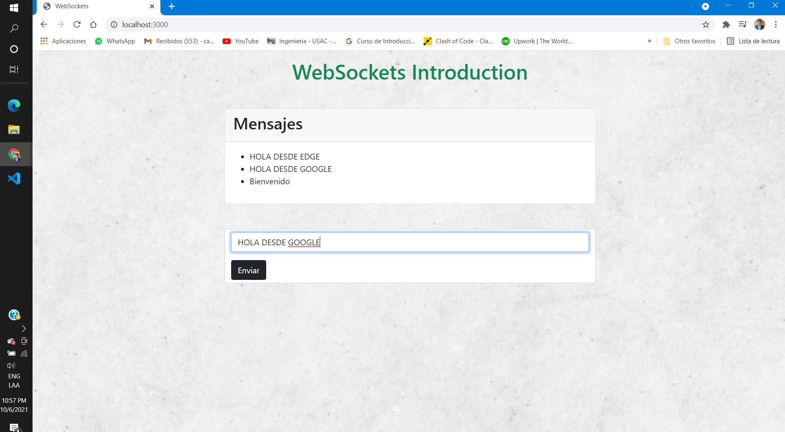

# Introducción a las WebSockets

## Indice
* ¿Qué es y cómo funciona HTTP?
* HTTP para apps realtime
* ¿Qué es y cómo funciona websockets?
* Demo
* Desventajas y limitaciones

## Introducción
Websockets es un protoclo de comunicación cliente/servidor a dos vías.
Es una alternativa al protocolo HTTP para escenarios con mucho intercambio de datos.

## El protocolo HTTP
Este protocolo se encuentra en la capa 7 del modelo OSI, en la capa de apliación.

### Características
* Normalmente funciona sobre TCP, aunque no es obligatorio, solo necesita un medio de transporte viable.
* Define la estructura de los mensajes
* Intercambio de mensajes cliente/servidor

Las caracteristicas de un protocolo son: 
* Es simple de entender por el humano
* Es extendible
* Es statless, es decir no hay un vínculo entre 2 peticiones
* Es independiente del formato, se pueden intercambiar imagenes, pdf, paginas web, datos, etc.
* Es <b> conectionless </b> es decir, que la conexión de este tipo es iniciada por el cliente y cuando el cliente recibe la repuesta la conexión se descarta.

### Flujo de una solicituda

1.  Se establece una conexión en la capa de transporte, normalmente TCP.
2. El cliente usa la conexión para enviar una solicitud.
3. El cliente espera con la conexión abierta hasta obtener una respuesta del servidor
4. El servidor procesa la solicitud y envía una respuesta.

## HTTP en aplicaciones de tiempo real

Las limitaciones y características de usar las estrategias con HTTP son: que es conectionless, que el cliente espera hasta recibir respuesta y que el cliente inicia una nueva solicitud por nuevos datos.

### Polling
Iniciar peticones periódicas para solicitar nuevos datos.

La mayor desventaja de esta implementación es que eel servidor estaba en constante uso recibiendo peticiones de todos los clientes conectados repetidamente.

### Long Polling
El long polling aprovecha que la conexión de comunicación se mantiene abierta hasta que el servidor finaliza una respuesta, durante ese tiempo el servidor puede esperara a que existan datos que pueda enviar.

Las desventajas de long polling son:
* Muchas conexiones
* Recursos desperdiciados
* Nuevas conexiones para enviar datos

### Ejemplo
Más teoría acerca del long polling y un pequeño ejemplo en nodejs.

[Long Pooling, qué es, casos y  ejemplo en nodejs](https://dev.to/obnsk/long-polling-comparative-and-sample-coded-expression-4anp)

## ¿Qué son las websockets?
Igual que HTTP se encuentra en la capa de aplicación y normalmente usa el protcolo TCP de la capa de transporte.

El protocolo de Websockets es una conexión dúplex de comunicación bidireccional entre el servidor y el cliente.

Tanto el servidor como el cliente, pueden leer y enviar datos, toda la comunicación se hace sobre una misma conexión, en esa misma conexión se envian y se reciben datos. Es de latencia reducida, latencia es el tiempo que demora en que responda el servidor.
Tiene un patrón pub/sub basado en eventos.

### ¿Cómo funciona el protocolo de websockets?

1. El cliente utiliza un proceso de handshake, usando HTTP, para actualizar a websockets.

2. El servidor responde vía la conexión HTTP que sí puede hacer el upgrade.

3. A partir de este momento, inicia el intercambio de mensajes usando un concepto que en inglés se llama message framing. Los mensajes se envian en frames, un mensaje puede ir divido en varios frames.

4. Adicionalmente, cliente y servidor pueden intercambair mensajes ping/pong. Es decir se envía un mensaje con la intensión de un ping, y el otro receptor, responde con un pong para saber que siguen conectados.

### Desventajes y limitaciones 
* Más complejo que HTTP
* Configuración especial en Frontend y Backend
* No hay estrategia de reconexión

## Ejemplo
El ejemplo se encuentra dentro de la carpeta ejemplo, la interzas del cliente realizada es la siguiente:

### Interfaz cliente
Esta es la interfaz del cliente 1, el cual utilza google chrome.

Esta es la interfaz del cliente 2, el cual utiliza edge.

### Flujo
El flujo es que al entrar al servidor http del cliente, este solicita el upgrade a websocket, al ser autorizado envía un mensaje de bienvenido el cual se muestra en el area de mensajes desde el inicio.

Al enviar un mensaje nuevo desde cualquiera de los clientes conectados, este mensaje se envía a todos los clientes. 

### Recuros
* Editor de código cualquiera
* Un archivo index.html para la página estática del servidor http
* Levantar un servidor http para el handshake con websocket
* Levantar un servidor para los websocket
* Instalar la librería express para el servidor http
* Instalar la librería websocket para el servidor websocket

## Link del tutorial
[Clase en vivo: Introducción a las WebSockets](https://www.youtube.com/watch?v=vBjfAmH67fg&list=PLpOqH6AE0tNifi6hr2aiP27DZ8R3R0Apy&index=11)

## Anexos
[¿Qué es el modelo OSI?](https://en.wikipedia.org/wiki/OSI_model)

[Long Pooling, qué es, casos y  ejemplo en nodejs](https://dev.to/obnsk/long-polling-comparative-and-sample-coded-expression-4anp)